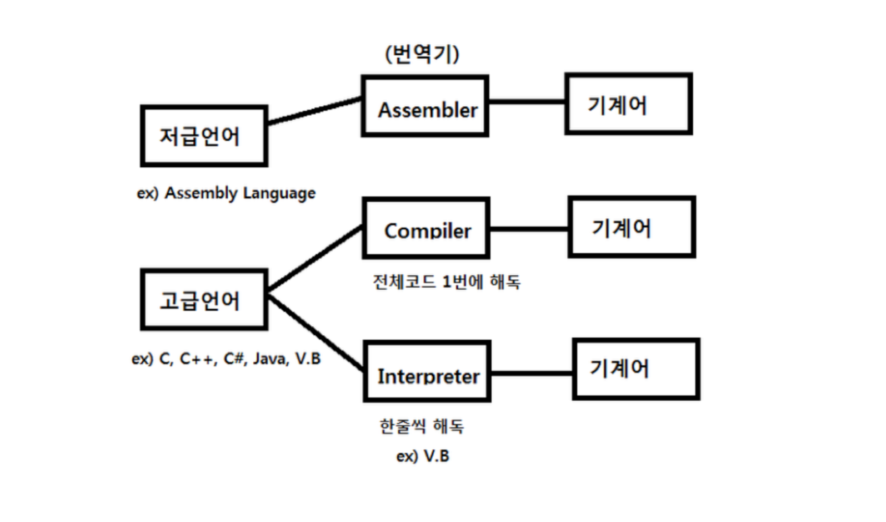

# 1. 프로그래밍 언어론(Programming Language)

### 프로그래밍 언어

* 인간이 컴퓨터와 의사소통할 수 있도록 컴퓨터가 이해할 수 있는 명령으로 프로그램을 작성할 수 있도록 만든 언어

### 프로그래밍 언어 - 결국 인간과 컴퓨터간의 의사소통:sparkles:

* 컴퓨터는 기계어만 이해한다.
    * 기계어란?
        * 0과 1로 된 이진수 형태
        * CPU가 이해할 수 있는 코드

### 저급 언어와 고급 언어: 원하는 언어로 컴퓨터에 명령을 전달할 수 있다.

#### 저급 언어

* **기계어**: 0과 1로 된 2진수 언어
* **어셈블리어**: 기계어 명령을 알기 쉬운 기호로 표시
    * EX) ADD A B
        * A 저장소에 있는 데이터에 B 저장소에 있는 데이터를 더해서 A 저장소에 저장해라!

#### 고급 언어

* 하드웨어의 기술적 요소를 상세하게 몰라도 작성 가능한 언어
    * 일상 언어(영어)에서 사용하는 표현으로 작성 가능
        * EX) +는 덧셈, -는 뺼셈
    * 기계어나 어셈블리어는 데이터 저장 주소(Address)를 정확하게 알아야 하지만, 고급 언어는 주소 대신 변수 이름으로 저장 장소에 접근 가능
    * 명령어 하나로 다수 동작 지시 가능
        * EX) y = x + (z * k)
* **대표적인 언어**: C, JAVA, Python 등

### 고급 언어와 기계어를 제외한 저급 언어는 결국 기계어로 변환되서 CPU에 전달되어 실행 됨

#### **컴파일러**: 고급 언어로 작성된 코드를 한번에 기계어로 변환하는 프로그램

* 대표적인 언어: C, JAVA 등

#### 인터프리터: 고급 언어로 작성된 코드를 한줄씩 기계어로 변환하는 프로그램

* 대표적인 언어: Python, PHP, Ruby 등

