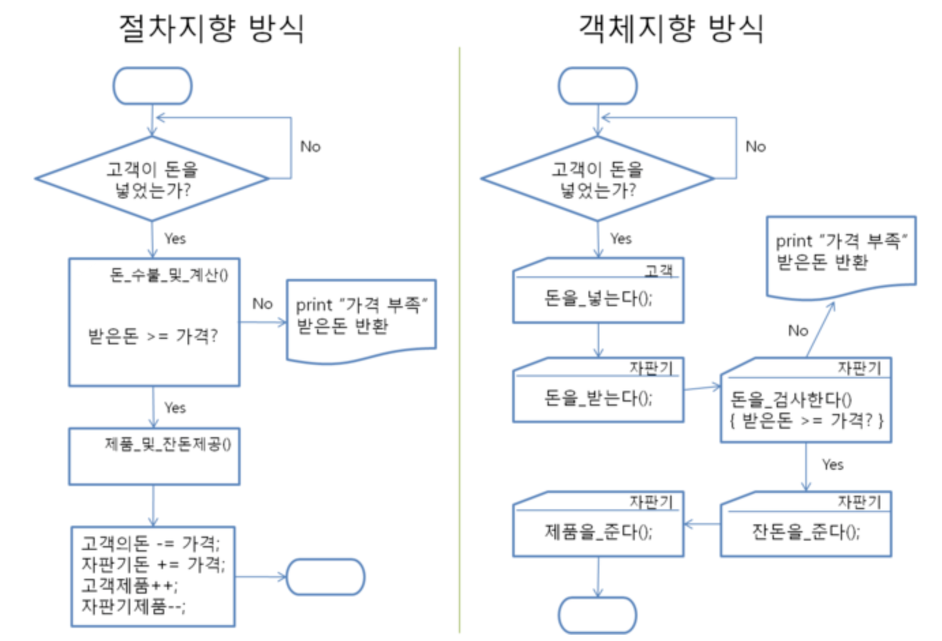

# 2. 객체지향 프로그래밍(Objected Oriented Programming)

## 절차지향과 객체지향 프로그래밍

### 절차지향 프로그래밍(Procedural Programming)

   * 물이 위에서 아래로 흐느는 것 처럼 **순차적인 처리**가 중요시 되며 프로그램 전체가 유기적으로 연결되도록 만드는 프로그래밍 기법
   * 컴퓨터의 작업 처리 방식과 유사하기 때문에 객체지향 프로그래밍보다 처리시간이 빠르다.
   * 대표적인 언어: 파스칼, 코볼, 포트란, C 등

#### 장점

* 컴퓨터의 처리구조와 유사해 실행 속도가 빠름

#### 단점

* 유지보수가 어렵다
* 실행 순서가 정해져 있으므로 코드의 순서가 바뀌면 동일한 결과를 보장하기 어려움
* 디버깅이 어려움

### 객체지향 프로그래밍(Objected Oriented Programming)

* 객체지향이란 **실제 세계를 모델링**하여 소프트웨어를 개발하는 방법
* 데이터와 절차를 하나의 덩어리로 묶어서 생각
    * 객체(object) 단위로 데이터와 기능(함수)를 하나로 묶어서 쓴다
* 3대 특성 **캡슐화, 상속, 다형성**

#### 캡슐화

* 캡슐화란 관련된 데이터와 알고리즘(코드)이 하나의 묶음으로 정리하여 코드와 데이터가 묶여있고 오류가 없어 사용이 편하다.

#### 상속

* 상속은 이미 작성된 클래스를 이어 받아서 새로운 클래스를 생성하는 기법으로, 기존 코드를 재활용해서 사용하는 것을 의미.
* 객체지향 프로그래밍의 가장 큰 장점 중 하나

#### 다형성

* 하나의 이름(방법)으로 많은 상황에 대처하는 기법
* 개념적으로 동일한 작업을 하는 함수들에 똑같은 이름을 부여할 수 있으므로 코드가 더 간단해진다.

#### 장점

* 코드의 재활용성이 높음
* 코딩이 절차지향 프로그래밍보다 간편함
* 디버깅이 쉬움

#### 단점

* 처리속도가 절차지향 프로그래밍보다 느림
* 설계에 많은 시간소요가 들어감

### 절차지향 프로그래밍과 객체지향 프로그래밍의 차이

## 객체지향 프로그래밍의 핵심

### class와 object

#### class란?

**class == 설계도**

* **속성(attribute)**와 **동작(method)**을 갖는 데이터 타입
* **속성(attribute)**은 **변수**와 유사
* **동작(method)**은 **함수**와 유사

#### object란?

**object == 객체**

* 선언된 **클래스**를 기반으로 만들어진 실체 ==> **객체(object)** 또는 **인스턴스(instance)**라고 함
* 하나의 **클래스** 설계도를 기반으로 수많은 **객체** 생성이 가능함

#### 정리

* class(설계도)
* object(객체)
* attribute(변수)
* method(함수)

### 객체지향 프로그램 작성 방법

1. 클래스 설계(attribute와 method로 구성)
2. 설계한 클래스를 기반으로 클래스를 코드로 작성
3. 클래스를 기반으로 필요한 객체 생성
4. 해당 객체의 attribute와 method를 조작하여 프로그램 수행